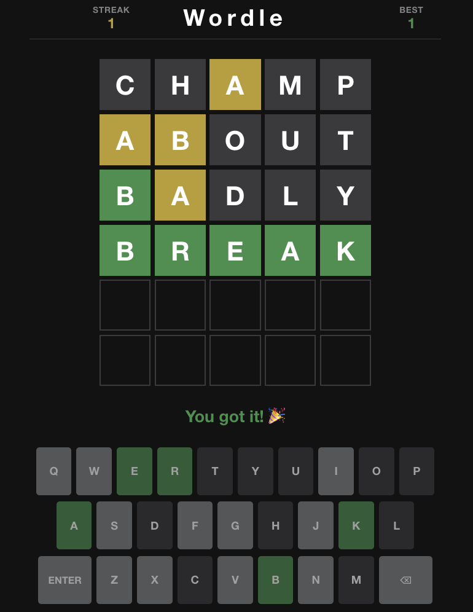

# 🟩 Wordle Clone

A browser-based Wordle game built with React. Guess the daily 5-letter word in six tries, watch tiles flip into green, yellow, and gray, and track your win streak — everything runs in the browser with a built-in word list. No API keys, no backend, no token costs.

[**TRY IT YOURSELF →**](https://yanisa-wordle.netlify.app)



---

## ✨ Features

### Core Gameplay
- **6 guesses, 5 letters** — Classic Wordle rules: one guess per row, six rows total.
- **Daily word** — Everyone gets the same answer for the calendar day, picked deterministically from a built-in list of 100 common words.
- **Tile feedback** — Letters turn **green** (correct spot), **yellow** (in the word, wrong spot), or **gray** (not in the word).
- **Flip animation** — Tiles flip one-by-one with a staggered 3D animation when a guess is submitted.
- **Win / lose messages** — Celebration on a win; reveals the answer when you run out of guesses.

### Input
- **Physical keyboard** — Type letters, press Enter to submit, Backspace to delete.
- **On-screen keyboard** — Full QWERTY layout with Enter and backspace; key colors update to match your best letter hints so far.

### Word List
- **~100 common 5-letter words** — Stored in `src/data/words.js` and used for both the daily answer and valid guesses.
- **Instant validation** — Guesses are checked locally against the list (no network calls).

### Win Streaks
- **Current streak** — Consecutive days won, shown in the header (left).
- **Best streak** — All-time high, shown in the header (right).
- **localStorage persistence** — Streaks survive page refreshes. Winning two days in a row increments the streak; losing resets the current streak to zero.

### UX Details
- **Shake animation** — Invalid or too-short guesses shake the active row.
- **Toast messages** — “Not enough letters”, “Not in word list”, etc.
- **Input lock** — Keyboard and typing are disabled while tiles are flipping.

---

## 🛠️ Tech Stack

| Layer | Technology |
|-------|------------|
| Frontend | **React 19** (Create React App) |
| Styling | **CSS3** — component-scoped styles, CSS variables for Wordle colors |
| Game logic | Custom hooks + pure JS utilities (evaluation, daily word, streaks) |
| Word data | Static **JavaScript array** in `src/data/words.js` |
| Persistence | **localStorage** (win streaks only) |

---

## 📁 File Structure

```
wordle-clone/
├── public/
│   └── index.html              # HTML shell
├── src/
│   ├── App.js                  # Layout, header streaks, game-over UI
│   ├── App.css
│   ├── index.js                # React entry point
│   ├── index.css               # Global theme variables
│   ├── data/
│   │   └── words.js            # 100 common 5-letter words
│   ├── hooks/
│   │   └── useWordle.js        # Game state, keyboard handlers, submit flow
│   ├── utils/
│   │   ├── game.js             # Daily word, guess evaluation, validation
│   │   └── streak.js           # Win-streak read/write (localStorage)
│   └── components/
│       ├── Grid.js             # 6-row board
│       ├── Row.js              # Single guess row
│       ├── Tile.js             # Letter tile + flip
│       ├── Tile.css
│       ├── Keyboard.js         # On-screen keyboard
│       └── Keyboard.css
├── package.json
└── README.md
```

---

## 🎬 How It Works

### Daily Word Selection

The answer is hashed from today’s date so all players see the same word on the same day:

```js
export function getDailyWord(date = new Date()) {
  const dateStr = `${date.getFullYear()}-${date.getMonth()}-${date.getDate()}`;
  let hash = 0;
  for (let i = 0; i < dateStr.length; i++) {
    hash = (hash << 5) - hash + dateStr.charCodeAt(i);
    hash |= 0;
  }
  return WORDS[Math.abs(hash) % WORDS.length];
}
```

### Guess Validation

Guesses must appear in the same `WORDS` array:

```js
export function isValidGuess(word) {
  return word.length === WORD_LENGTH && WORDS.includes(word.toUpperCase());
}
```

### Guess Evaluation (Green / Yellow / Gray)

Standard Wordle two-pass algorithm in `evaluateGuess()`:

1. **First pass** — Mark exact position matches as `correct` (green).
2. **Second pass** — For remaining letters, mark `present` (yellow) if the letter exists elsewhere in the answer at an unused position; otherwise `absent` (gray).

Duplicate letters are handled correctly (e.g. answer `SPEED`, guess `EERIE` → only two yellow E’s).

### Tile Flip Animation

Each tile has a front face (letter on empty/dark background) and a back face (colored). On submit:

- Row enters `isRevealing` state with status classes (`tile--correct`, etc.).
- Each tile’s inner element animates `rotateX` with `animationDelay: index × 300ms`.
- After ~1.6s, the guess is committed to state and the next row becomes active.

### Win Streak Logic

| Event | Effect |
|-------|--------|
| Win today (first time) | If last win was **yesterday** → `currentStreak + 1`; otherwise → reset to **1** |
| Win today (again, same day) | No change (refresh-safe) |
| Lose | `currentStreak = 0` |
| Any win | `bestStreak = max(bestStreak, currentStreak)` |

Stored under localStorage key `wordle-streak`.

---

## 🔒 Privacy & Data

| Data | Where it lives |
|------|----------------|
| Guesses & daily word | **In memory only** — never sent to a server |
| Win streaks | **localStorage** in your browser |

The game works fully offline after the initial page load.

---

## 🎨 Theming

Colors are defined as CSS variables in `src/index.css`:

| Variable | Default | Use |
|----------|---------|-----|
| `--color-correct` | `#538d4e` | Green tiles / keys |
| `--color-present` | `#b59f3b` | Yellow tiles / keys |
| `--color-absent` | `#3a3a3c` | Gray tiles / keys |
| `--color-bg` | `#121213` | Page background |

---

## ❗️ Limitations

This application uses a 100 5-letter word dataset. As a result, many 5-letter words would not register on this application. I did not want to include a large static dataset due to memory usage and it being so unnecessary due to how many words there are in existence. Initially, I incorporated AI to detect words that were not included in the dataset but are still valid 5-letter words. However, due to using AI API keys on a free tier, it is very frequent that I ran into an insuffient tokens error. Thus, I decided to stick to a smaller dataset and focus on creating a game that works well and is entertaining for users. 

---

## 👩‍💻 Author

**Yanisa Srisa-ard**

- Portfolio: [yanisa.netlify.app](https://yanisa.netlify.app)
- GitHub: [@yanisasri](https://github.com/yanisasri)
- LinkedIn: [linkedin.com/in/yanisa](https://linkedin.com/in/yanisa)

---

## 🙏 Acknowledgments

- Game design inspired by [Wordle](https://www.nytimes.com/games/wordle) (The New York Times)
- Bootstrapped with [Create React App](https://create-react-app.dev/)
